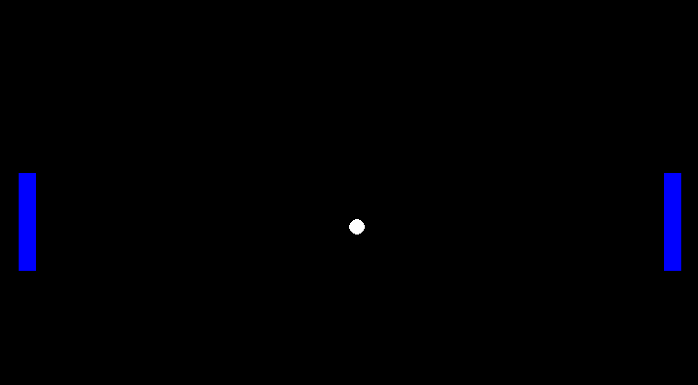

# Classic Pong Game
### Overview
A simple game of Pong developed using the pygame module on Python.

## Prerequisites
<b>Minimum Python version(s)</b> 
-Python 3.3 or Python 3.4 (preferred) 
<b>Pip installations:</b>
- [Pygame](https://pypi.org/project/pygame/)
'''
pip install pygame
'''
- [Asyncio](https://pypi.org/project/asyncio/)
'''
pip install asyncio
'''

## Motivation
I began this project to test myself as a Python beginner and to explore software development as a possible career path

## Screen Recording

## License
None (public domain)
